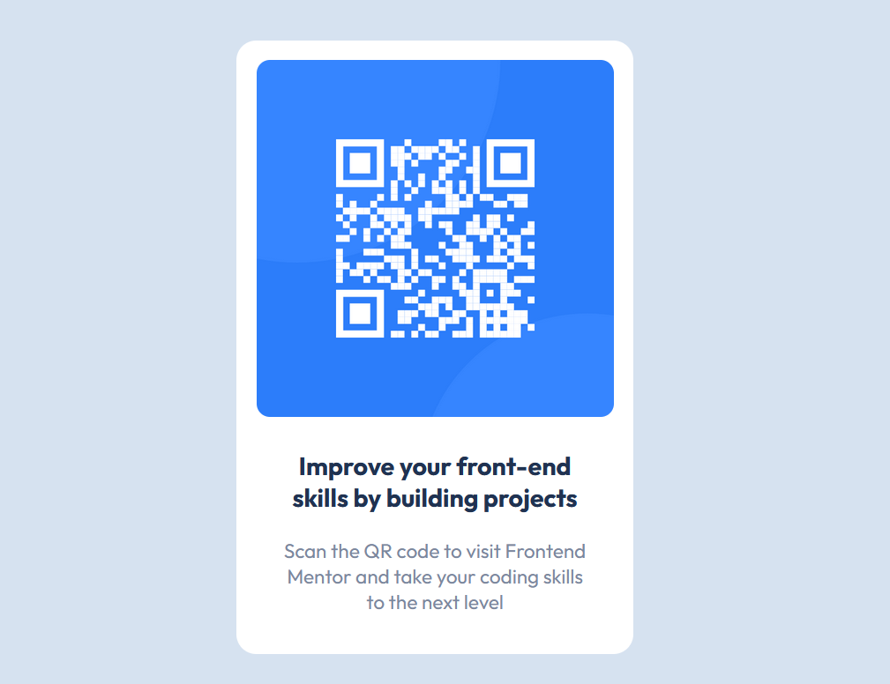

# Frontend Mentor - QR code component

Live Preview: https://lspacka.github.io/qr-code-component-main/

This is my solution to the [QR code component challenge on Frontend Mentor](https://www.frontendmentor.io/challenges/qr-code-component-iux_sIO_H).

## Built with: 
- HTML 
- CSS

## Author

- Frontend Mentor - [@lspacka](https://www.frontendmentor.io/profile/lspacka)
- Twitter - [@lspacka](https://www.twitter.com/lspacka)
